# Higher or Lower 

Higher or Lower is a game that is for anyone who wants to play with chance and numbers. The game is based on a swedish cardgame that is often used as a drinking-game with the same name. The user is to guess what random number within the difficulty-range the computer has generated within three attempts or the computer gets a point.   
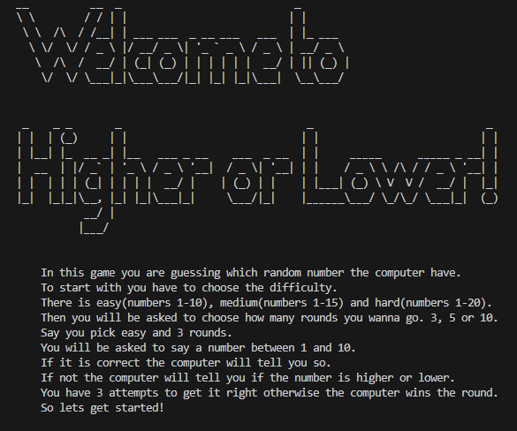 
## How to play 
Before the user can start the game they have to enter their name, which difficulty they want to play and how many rounds they want to go. 

There are three different difficulties. Easy, medium and hard. On the easy difficulty the computer generates a number between 1 and ten, medium is numbers 1 to 15 and hard is numbers 1 to 20. 

The user then gets to choose how many rounds they want to go. They can choose 3, 5 or 10 rounds. 

After theese first steps it time to play the game! 

Round 1 starts and the user is asked to guess which number the computer has generated as the secret number. Let's say the secret number is 7 but the user guesses 5. Since 7 is higher than 5 the user will get a message that says "Higher!" so they know to guess a number higher than 5. The user has three attempts to guess the secret number right. If they do they get a point but if they don't the computer gets a point. 

This goes on for as many rounds as the user chose and then they're presented with the final score. 

## Features 

#### Welcome 

- A message that welcomes the user and gives them instructions on how to play the game. 

 

#### Name input 

- The user is asked to enter their name 

- The input has to be letters only 

- The code capitalizes the name when returning it

- The code throws an error if numbers or blanks are inserted as username 

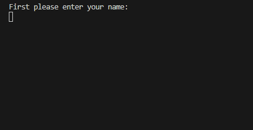 

#### Difficulty setting 

- Here the user chooses what difficulty they want. There is easy(numbers 1-10), medium(numbers 1-15) and hard(1-20). 

- If the user where to input anything else than easy, medium or hard an error message will show and tell them which values are valid. 

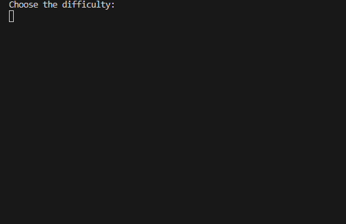 

#### Number of rounds 

- The user is asked to make the choice of how many rounds they want to go. 3, 5 or 10. 

- If the user enters a value that is not 3, 5 or 10 the code will throw an error telling the user what values are valid. 

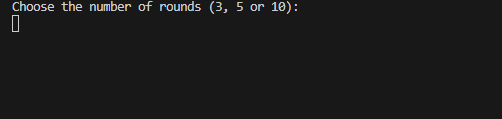 

#### A round 

- A round starts with the user guessing what number the computer has generated as the secret number. 

- If the value is higher or lower than the difficulty range the code will throw an error and tell the user to stay within the range. 

- If the guess is correct the user will see a message that says that the guess was correct and then it moves on to the next round. 

- If the secret number is higher than the guess the user will be told to guess "Higher!". 

- If the secret number is lower than the guess the user will be told to guess "Lower!" 

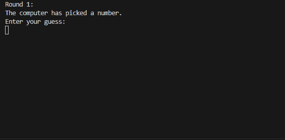 
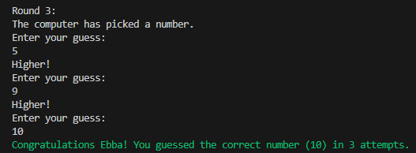

#### Final score 

- After the last round the user will be met with their final score and if they won or not. 

- If the user wins a green text saying "YOU WIN!" will appear. 

- If the user wins by only one point a green text saying "A WIN IS A WIN!" will show up. 

- If the user looses a red message saying "GAME OVER!" shows up. 

- If the user looses by one point there will be a red message saying "SO CLOSE". 

- If the user and the computer gets the same amount of points a message saying "IT'S A TIE" will show up. This of course can only happen if the user chooses to go 10 rounds. 

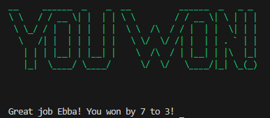
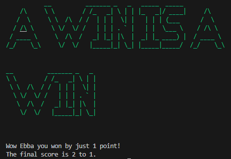
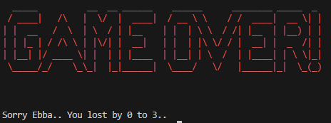
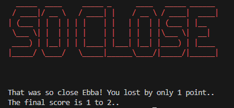
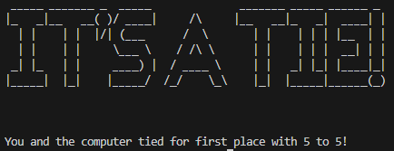

## Imported libraries
### Random
- To be able to generate a random rumber I imported the random library
### Styling
- To add some style to the game I imported modules from "colorama" and "pyfiglet"
    - Colorama makes it possible to turn my text to the color I want
    - Pyfiglet has a range of different fonts you can choose from. I chose "big" to make some messages stand out to the user.  

## Testing 

 

### Manual Testing 

- The code was put through PEP8 linter and confirmed that there were no problems. 

- No problems where encountered when testing the game in both the VS code console and the Heroku deployment. 

 

 

| Feature | Expected Outcome | Testing Performed | Result | Pass/Fail | 
| --- | --- | --- | --- | --- | 
| Welcome message | The message shows up when the code runs | Run code | Welcome message shows up | Pass | 
| Name input | "Let's play {user_name}!" | Insert name using letters | Let's play message shows up | Pass | 
| Choose difficulty | The game moves on to the next step | Entered "easy" | The code moved on to "choose number of rounds" | Pass | 
| Number of rounds | Starts round number one | Entered "3" to choose three rounds | Round 1 starts | Pass | 
| Game round | You are asked to guess the secret number | Entered a value within the difficulty range | "Higher!", "Lower!", "Congratulations"-message | Pass | 
| Final score | The user gets a message that tells them if they won or lost of tied | Completed all rounds | The correct message came up according to the final score | Pass | 

 

## Bugs 

### Remaining bugs 

- The welcome message is not positioned to the left. 

- The only thing that made this bug go away when looking at the game was moving the code all the way to the left but that made the indenting faulty so I had to choose between a nice and clean code and a welcome message positioned to the left.

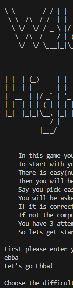

## Deployment 

This project was deployed to Heroku using Code Institute's mock terminal. 

- Steps for deployment 

- In Heroku I created a new app. 

- I set the buildpacks to Python and NodeJS 

- I linked the app with my github repository 

- I manually deployed the project by clicking deploy 

## Credits 

- Code Institute for the mock terminal 

- Kera Cudmore's readme for The Quiz Arms  
